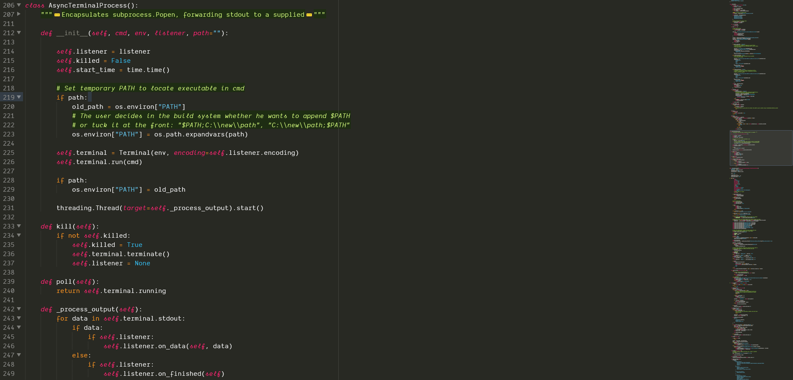
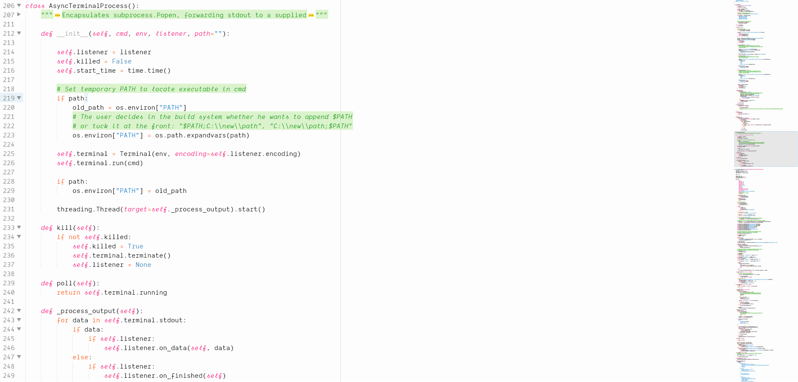

# SublimeSummerfruit

Vivid and fresh color scheme with light and dark flavors.

This theme is based on the wonderful [Summerfruit256 color scheme for vim](https://github.com/vim-scripts/summerfruit256.vim), which in my opinion is one of the best-looking light color schemes. There is already a [port of the Summerfruit color scheme for Sublime Text](https://packagecontrol.io/packages/Summerfruit%20Color%20Scheme), which I adapted and extended for my needs.

## Examples

There is a dark variant of the Summerfruit color scheme, which is loosely based on Monokai's colors. Therefore one may use light and dark color schemes depending on the environment and time (e. g. see the [SunCycle](https://packagecontrol.io/packages/SunCycle) and [ThemeScheduler](https://packagecontrol.io/packages/ThemeScheduler) packages).

### Dark flavor:

### Light flavor:

*The font used in the screenshots is [Dank Mono](https://dank.sh/).*

## Languages

I use these themes mainly for **Python** and **Markdown**. They are also optimized for usage with [GitSavvy](https://packagecontrol.io/packages/GitSavvy) and [BetterFindBuffer](https://packagecontrol.io/packages/BetterFindBuffer). I expect that the highlighting in other languages is not optimal. If you have suggestions or improvements, please feel free to let me know.

